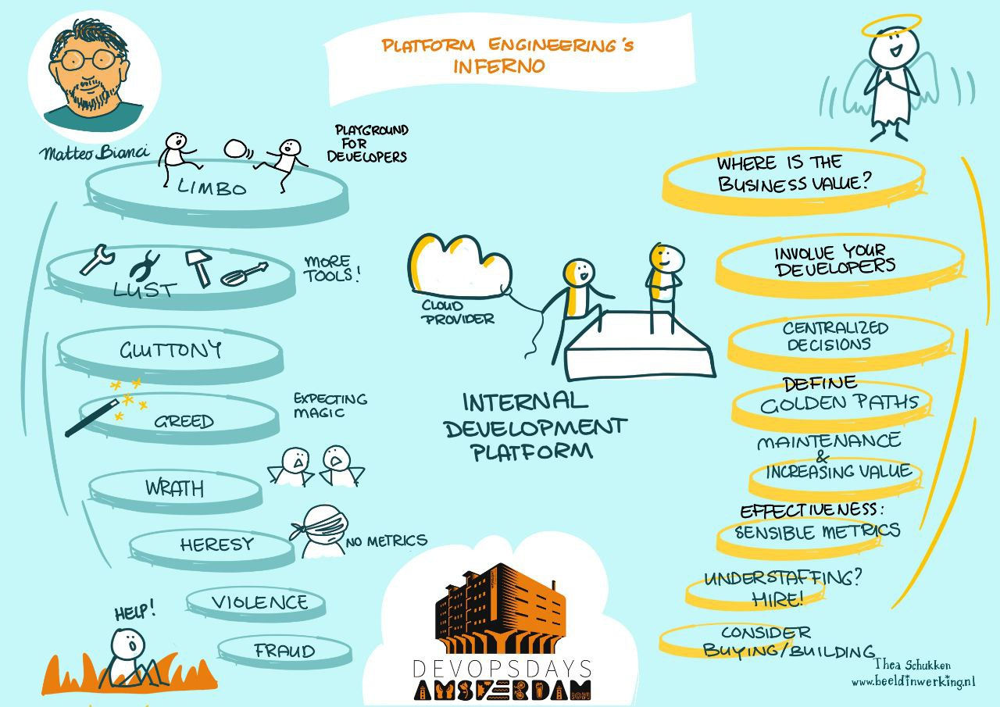

# Plaform Engineering Roadmap

An opinionated roadmap to become a Platform Engineer.

Visit [https://mbianchidev.github.io/platform-engineering-roadmap](https://mbianchidev.github.io/platform-engineering-roadmap) to have an overview.

The roadmap is inspired by [Teivah's SRE roadmap](https://github.com/teivah/sre-roadmap), but my idea is a bit different.
In time, I created something similar to [roadmap.sh](https://roadmap.sh/) but for Platform Engineers.

## About me 

I have been a Platform Engineer even before the name was out there, fighting Conway Law, dealing with team topologies (yes, before the book).

It was called DevOps Engineering before and previously Operations, but deep down we were already building the foundations of automation, pipelines, infrastructure and everything that turned out to be Platform Engineering.

Why did I build this website? Just because.

This picture is from one of my talks, at DevOpsDay Amsterdam 2024 - Platform Engineering's Inferno - you can find a video [here](https://www.youtube.com/watch?v=dWn48x4v34Q).

_Note: This repo also contains a [Platform Engineering Manifesto](platform-engineering-manifesto.md) which is playfully inspired by the Agile Manifesto._

## Contributing

I want this roadmap to be useful to the largest amount of people and if you want to help you are very welcome. 

Any contribution matters, may that be an input, a feedback or even a PR.

## License

Usual MIT, we love that.

## Note

The previous readme content can be found in [LEGACY.md](LEGACY.md) all new updates will be in the interactive website instead.
