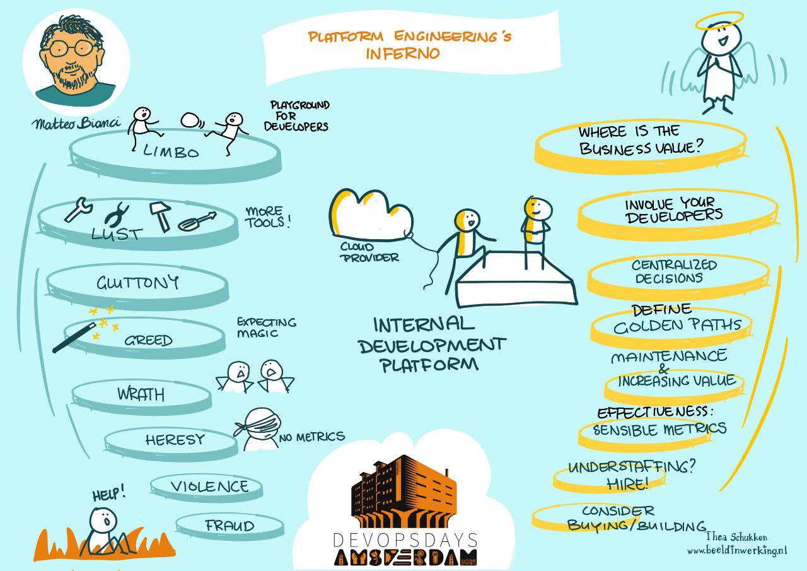

# Platform Engineering Roadmap

An opinionated roadmap to become a Platform Engineer, including AI, ML, and AI agent practices for SRE and platform work.

Visit [https://platform-engineering-roadmap.mbianchi.dev/](https://platform-engineering-roadmap.mbianchi.dev/) to have an overview.

The roadmap is inspired by [Teivah's SRE roadmap](https://github.com/teivah/sre-roadmap), but my idea is a bit different.

In time, I created something similar to [roadmap.sh](https://roadmap.sh/) but for Platform Engineers.

## Explore the roadmap

The topic atlas groups the roadmap into **Individual Skills**, **Certifications**, and **Company Level**. Branch connections show categories, not prerequisites or a mandatory learning order.

Technical topics include [data services and recovery](https://platform-engineering-roadmap.mbianchi.dev/#topic=data-recovery), [platform testing](https://platform-engineering-roadmap.mbianchi.dev/#topic=platform-testing), [multi-tenancy and isolation](https://platform-engineering-roadmap.mbianchi.dev/#topic=multi-tenancy), and [AI workload infrastructure](https://platform-engineering-roadmap.mbianchi.dev/#topic=ai-workload-infrastructure). Company-level topics cover [FinOps and platform economics](https://platform-engineering-roadmap.mbianchi.dev/#topic=finops) and [platform lifecycle](https://platform-engineering-roadmap.mbianchi.dev/#topic=platform-lifecycle), alongside adoption, culture, and governance.

- All topics are visible by default, with no **Show more** step. Branch headers still let you collapse and expand whole groups.
- Search topic names, descriptions, key areas, and resource titles. Multiple search terms must all match the same topic.
- Open a topic to read the same descriptions, key areas, and resources in a centered dialog. The roadmap stays behind a blurred backdrop, with keyboard focus inside the dialog and background scrolling paused.
- Share the topic's URL, such as [`#topic=cloud-native`](https://platform-engineering-roadmap.mbianchi.dev/#topic=cloud-native). Browser Back and Forward preserve topic navigation. Use **Close topic**, press Escape, or click the backdrop to return to the roadmap with your search and focus restored.
- Dark mode is the default, regardless of your device's theme. Use the moon/sun button in the header to switch modes; your choice is saved in this browser. If browser storage is blocked, switching still works for the current page but cannot persist after reloading.

## Run locally

Use Node.js 22 (the CI version) or a supported newer LTS release.

```bash
npm ci
npm run dev
```

Open the local URL printed by Vite. See [CONTRIBUTING.md](CONTRIBUTING.md#development-setup) for build and test commands. The site remains a static React/Vite application; no backend, account, or external font service is required.

## About me 

I have been a Platform Engineer even before the name was out there, fighting Conway Law, dealing with team topologies (yes, before the book).

It was called DevOps Engineering before and previously Operations, but deep down we were already building the foundations of automation, pipelines, infrastructure and everything that turned out to be Platform Engineering.

Why did I build this website? Just because.



This picture is from one of my talks, at DevOpsDay Amsterdam 2024 - Platform Engineering's Inferno - you can find a video [here](https://www.youtube.com/watch?v=dWn48x4v34Q).

_Note: This repo also contains a [Platform Engineering Manifesto](platform-engineering-manifesto.md) which is playfully inspired by the Agile Manifesto._

## Contributing

I want this roadmap to be useful to the largest amount of people and if you want to help you are very welcome. 

Any contribution matters, may that be an input, a feedback or even a PR.

## Deployment

The site is deployed to GitHub Pages from `main` by [the Pages workflow](.github/workflows/deploy.yml). The custom domain is declared in [`public/CNAME`](public/CNAME), and Vite builds root-relative asset URLs because the site is served from the custom domain root.

## License

Usual MIT, we love that.

## Note

The previous readme content can be found in [LEGACY.md](LEGACY.md) all new updates will be in the interactive website instead.
